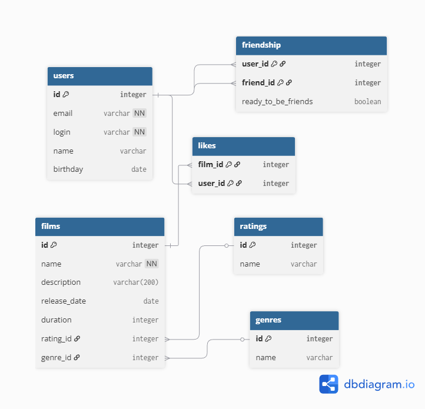

# Схема базы данных

Эта схема описывает структуру базы данных для приложения Filmorate.

**Основные элементы схемы:**

1.  Таблицы `users` и `films` — это основа базы. В них в полях хранятся все данные профилей и информация о кино.

2.  Возрастные рейтинги и жанры вынес в отдельные таблицы-справочники: `ratings` и `genres`. Фильмы ссылаются на них через ID.

3.  Остальные таблицы:
    *   `likes` — запоминает, какой пользователь лайкнул какой фильм (использовал составной ключ).
    *   `friendship` — хранит связи между друзьями и статус подтверждения дружбы(использовал составной ключ). 